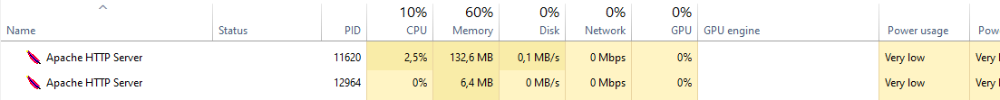

# IF4031_2020_T01_K01_G09

## Hasil Benchmark Web Server NGINX dan Apache 
### Tool benchmark yang digunakan
Pada tugas ini, kelompok kami menggunakan Apache Benchmark. Tes dapat dilakukan dengan cara: 

`
ab -n [num_of_request] -c [num_of_concurrent_request] http://hostname[:port]/[path]
`

dengan:
- `[num_of_request]` sebagai jumlah request yang diinginkan (pada testing kali ini, valuenya adalah 10000)
- `[num_of_concurrent_request]` sebagai jumlah request yang dilakukan pada saat yang bersamaan (pada testing kali ini, valuenya adalah 10000)
- `[:port]` adalah port dimana server berjalan.

Sebagai contoh, untuk **nginx**, dilakukan testing dengan cara:

`
ab -n 10000 -c 10000 http://localhost/
`

### NGINX
**File 500B**

**File 20kB**

### Apache

**File 500B**

**File 20kB**

## Web Server dengan Low Level Library

### Building & Cara Menjalankan Program

*Low Level library* yang kami gunakan untuk membuat web server adalah **Libevent** . Berikut ini adalah cara menjalankan programnya :
1. clone project ini
2. `cd` ke folder project
3. `mkdir build` untuk membuat directory build
4. `cd build`
5. `cmake ..` (pastikan cmake sudah terinstall dalam sistem)
6. `make` (pastikan library libevent sudah terinstall)
7. `./webserver <PORT> <FILEPATH>`

### Hasil Testing

**File 500B**

**File 20kB**

*Keterangan: Dapat dilihat dari gambar, concurrency level pada server yang menggunakan low level library 1000 pada file 500B dan 100 pada file 20kB, hal ini terjadi karena tidak dapatnya server menerima concurrent request sebesar 10000, sehingga harus dikurangi menjadi 1000 dan 100.*

## Web Server dengan High Level Library

### Building & Cara Menjalankan Program

*High Level Library* yang kami gunakan untuk membuat web server adalah **Node JS** . Berikut ini adalah cara menjalankan programnya : 
1. clone project ini
2. `cd` ke folder project
3. jalankan `node server_high.js <PORT> <FILEPATH>`

### Hasil Testing

**File 500B**

**File 20kB**

